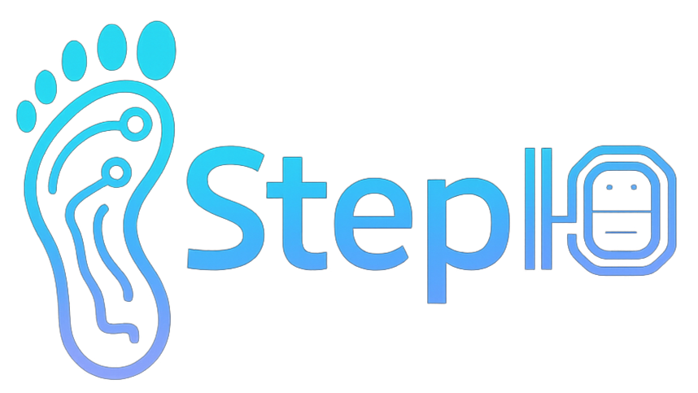

# StepIO



## Overview

**StepIO** is a modern, privacy-first step counter and activity tracker app built with Expo Router, React Native, and native Android services. Its goal is to motivate you to move more, while keeping all your data securely on your device—no external servers, no data collection.

## Main Features

- **Step Counting**: Real-time step tracking using a native Android service.
- **Path Tracking**: Map and save your walking or running routes with GPS.
- **Statistics**: Visualize your activity with daily, weekly, monthly, and yearly charts and summaries.
- **Activity Log**: Browse all your saved routes and activities with detailed stats.
- **Goal Setting**: Set a daily step goal and get motivational tips.
- **Onboarding**: Personalized setup on first launch (name, email, age, daily goal).
- **Privacy**: All data is stored only on your device. Nothing is uploaded or shared.

## App Structure

```
app/
├── _layout.tsx                # Navigation layout
├── index.tsx                  # Home screen (daily summary)
├── path-tracking.tsx          # Path tracking
├── stats/                     # Statistics
│   ├── index.tsx              # Overview
│   └── [id].tsx               # Activity details
├── activities/                # Activities
│   ├── index.tsx              # List
│   └── [id].tsx               # Details
├── profile.tsx                # Profile
├── calendar/                  # Date picker
│   └── index.tsx
├── (onboarding)/              # First launch flow
│   ├── welcome.tsx            # Welcome screen
│   ├── user-info.tsx          # User info
│   └── daily-target.tsx       # Daily goal selection
components/
├── TrackedMap.tsx             # Route map component
├── WeatherWidget.tsx          # Weather widget
src/
├── services/                  # Native services
│   ├── nativeStepCounterService.ts
│   └── appInitializationService.ts
├── store/                     # Zustand store
│   └── useStepStore.ts
├── utils/                     # Utility functions
│   └── permissions.ts
styles/
├── theme.ts                   # Colors, fonts
assets/
├── images/                    # Logo, background, splash
```

## Installation & Usage

This project uses the **Expo bare workflow** and the **Expo dev-client** for local development and testing. Production APK builds are created using **EAS (Expo Application Services)**.

- The latest APK is always available for free download from the official landing page.

1. **Requirements**: Node.js, Yarn or npm, Android Studio (for emulator or device), Expo CLI, Expo Dev Client.
2. **Install dependencies**:
   ```powershell
   git clone <repo-url>
   cd StepIO
   yarn install # or npm install
   ```
3. **Run the app (with dev client)**:
   ```powershell
   yarn start # or npm start
   # or
   yarn android # or npm run android
   ```
   > For local development, make sure you have the Expo Dev Client installed on your device or emulator.

## Main Screens & Features

### 👋 Onboarding

- Welcome screen, user info (name, email, age), daily step goal selection.

### 🏠 Home

- Daily step count, motivational message, quick stats.

### 🗺️ Path Tracking

- Live map, real-time step and route recording, start/stop button.

### 📊 Statistics

- Daily/weekly/monthly/yearly charts and summaries.

### 🏃 Activities

- List of saved walks/runs, detailed view with map, steps, duration.

### 👤 Profile

- User info, change daily goal, privacy policy and terms of service.

## Privacy

- **StepIO does not collect or store any personal data on servers.**
- All information stays on your device only.
- You can delete your data at any time from within the app.

## Technology

- **React Native** (Expo)
- **Zustand** (state management)
- **react-native-maps** (maps)
- **expo-location** (location)
- **expo-haptics** (haptics)
- **Native Android ForegroundService** (step counting, route logging)

## Developer Notes

- **Workflow**: Expo bare workflow, custom native modules, and Expo dev-client for development.
- **Builds**: APKs are built and signed using [EAS Build](https://docs.expo.dev/build/introduction/). See `eas.json` for configuration.
- Native services are written in Kotlin and log steps/routes in JSON files.
- App state is managed by `src/store/useStepStore.ts` (Zustand).
- All screens are organized with Expo Router.

## License

StepIO is free to use, all rights reserved. Author: **Zsolt Márku**. The app is provided "as-is" with no warranty. Any misuse or unauthorized distribution may have legal consequences.

---

**Take a step for your health – StepIO!**
